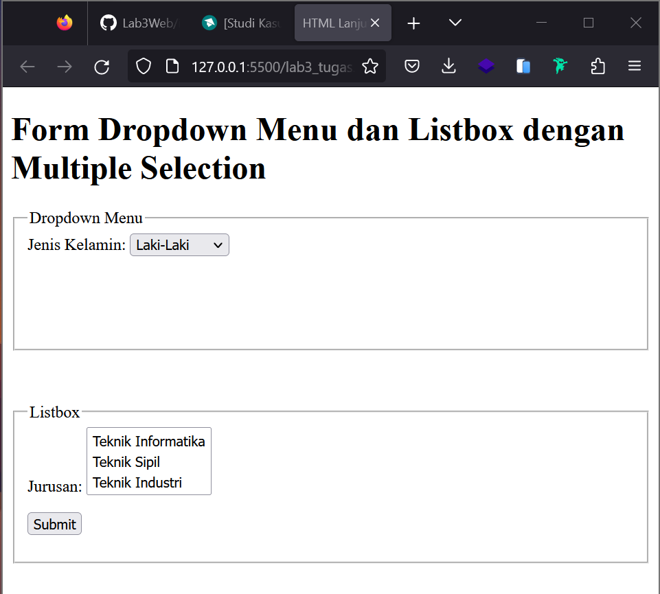

# Lab3Web
## Praktikum 3 Pemograman Web 1
### Tugas

- Codingannya


### Praktikum
1. Membuat Ordered List, Unordered List dan Description List di file lab3_list.html

- Membuat Ordered List dengan menuliskan code berikut :

```
<!DOCTYPE html>
<html lang="en">
<head>
    <meta charset="UTF-8">
    <meta name="viewport" content="width=device-width, initial-scale=1.0">
    <title>HTML Lanjutan</title>
</head>
<body>
    <header>
      <h1>Membuat List</h1>
    </header>


    <section id="order-list">
        <h2>Ordered List</h2>
        <ol>
          <li>Pemrograman Web</li>
          <li>Sistem Informasi</li>
          <li>Basis Data 2</li>
        </ol>
    </section>
</body>
</html>
```


- Menambahkan Code berikut untuk membuat Unordered List

```
<section id="unorder-list">
  <h2>Unordered List</h2>
  <ul type="square">
    <li>Jaringan Komputer</li>
    <li>Struktur Data</li>
    <li>Algoritma &amp; Pemrograman</li>
</ul>
</section>
```


- Membuat Description List

```
<section id="unorder-list">
  <h2>Description List</h2>
  <dl>
    <dt>Fakultas Teknik</dt>
    <dd>Teknik Industri</dd>
    <dd>Teknik Informatika</dd>
    <dd>Teknik Lingkungan</dd>
    <dt>Fakultas Ekonomi dan Bisnis</dt>
    <dd>Akuntansi</dd>
    <dd>Manajemen</dd>
    <dd>Bisnis Digital</dd>
  </dl>
</section>
```


2. Membuat table di file lab3_table.html

```
<html lang="en">
<head>
    <meta charset="UTF-8">
    <meta name="viewport" content="width=device-width, initial-scale=1.0">
    <title>HTML Lanjutan</title>
</head>
<body>
    <header>
      <h1>Membuat Table</h1>
    </header>

<table border="1" cellpadding="4" cellspacing="0">
    <thead>
      <tr>
<th>No.</th>
<th>Fakultas</th>
<th>Program Studi</th>
      </tr>
    </thead>
    <tbody>
        <tr>
            <td>1.</td>
            <td>Teknik</td>
            <td>Teknik Informatika</td>
        </tr>
        <tr>
            <td>2.</td>
            <td>Teknik</td>
            <td>Teknik Industri</td>
        </tr>
        <tr>
            <td>3.</td>
            <td>Teknik</td>
            <td>Teknik Lingkungan</td>
      </tr>
    </tbody>
</table>
</body>
</html>
```


- Mengatur Margin dan Padding pada table dengan menambahkan code berikut:
`<table border="1" cellpadding="4" cellspacing="0">`

      -border untuk mengubah bingkai pada table
      -cellpadding untuk mengatur jarak border dengan cell atau isi
      -cellspacing untuk mengatur jarak antar cell atau isi


-Menggabungkan Cell Data dengan menambahkan rowspan atau colspan seperti berikut :
```
<table border="1" cellpadding="6" cellspacing="0">
  <thead>
    <tr>
      <th>No.</th>
      <th>Fakultas</th>
      <th>Program Studi</th>
    </tr>
  </thead>
  <tbody>
    <tr>
      <td>1.</td>
      <td rowspan="3">Teknik</td>
      <td>Teknik Informatika</td>
    </tr>
    <tr>
      <td>2.</td>
      <td>Teknik Industri</td>
    </tr>
    <tr>
      <td>3.</td>
      <td>Teknik Lingkungan</td>
    </tr>
  </tbody>
</table>
```

    Atribut rowspan untuk menggabungkan cell antar baris
    Atribut colspan untuk menggabungkan cell antar kolom


3. Membuat Form pada file lab3_form.html

```
<!DOCTYPE html>
<html lang="en">
<head>
  <meta charset="UTF-8">
  <meta name="viewport" content="width=device-width, initial-scale=1.0">
  <title>HTML Lanjutan</title>
</head>
<body>
  <header>
    <h1>Membuat Form</h1>
  </header>

  <form action="proses.php" method="post">
    <fieldset>
      <legend>Data Pelanggan</legend>
        <p>
          <label for="nama">Nama</label>
          <input type="text" id="nama" name="nama">
        </p>
        <p>
          <label for="alamat">Alamat</label>
          <textarea id="alamat" name="alamat" cols="20" rows="3"></textarea>
        </p>
        <p>
          <label>Jenis Kelamin</label>
          <input id="jk_l" type="radio" name="kelamin" value="L" /><labelfor="jk_l">Laki-laki</label>
          <input id="jk_p" type="radio" name="kelamin" value="P" /><labelfor="jk_p">Perempuan</label>
        </p>
        <p><input type="submit" value="Login"></p>
    </fieldset>
  </form>

</body>
</html>
```


- Menambahkan Style pada Form
```
<style>
    form p > label {
        display: inline-block;
        width: 100px;
    }
    form input[type="text"], form textarea {
        border: 1px solid #197a43;
    }
    form input[type="submit"] {
        border: 1px solid #197a43;
        background-color: #197a43;
        color: #ffffff;
        font-weight: bold;
        padding: 5px 15px;
    }
</style>
```

